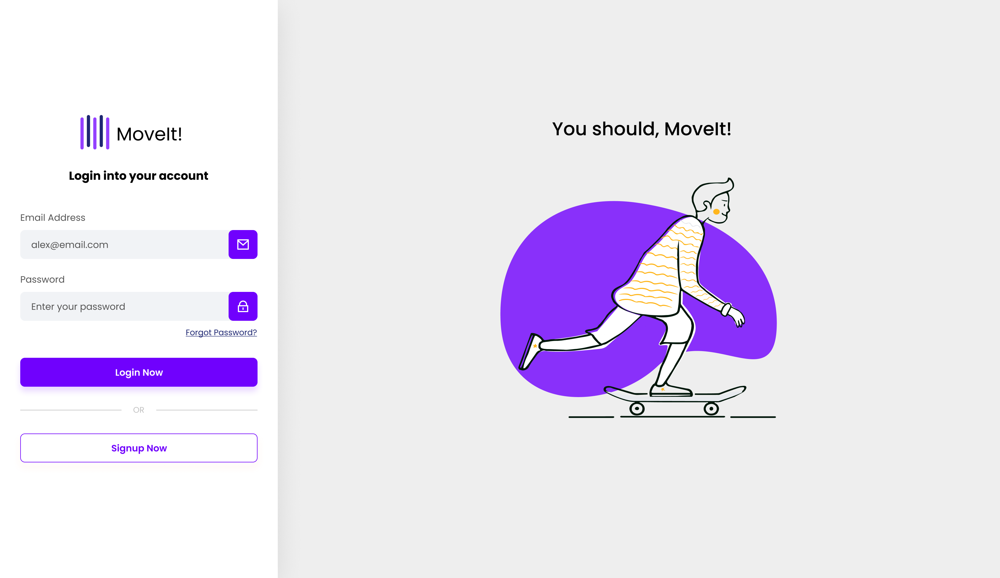

[TYPESCRIPT__BADGE]: https://img.shields.io/badge/typescript-D4FAFF?style=for-the-badge&logo=typescript
[ANGULAR__BADGE]: https://img.shields.io/badge/Angular-red?style=for-the-badge&logo=angular
[JAVA]: https://img.shields.io/badge/java-007396?style=for-the-badge&logo=java&logoColor=white
[SPRINGBOOT]: https://img.shields.io/badge/spring%20boot-6DB33F?style=for-the-badge&logo=spring&logoColor=white

<h1 align="center" style="font-weight: bold;">Página de Login em Angular 💻</h1>

![angular][ANGULAR__BADGE]
![typescript][TYPESCRIPT__BADGE]
![Java][JAVA]
![Spring Boot][SPRINGBOOT]

<p align="center">
 <a href="#about">Sobre</a> • 
 <a href="#started">Primeiros passos</a> • 
 <a href="#started">Rotas do aplicativo</a> • 
</p>


<p align="center">
    
</p>

<h2 id="started">📌 Sobre</h2>

Este projeto é um aplicativo simples de login para praticar e aperfeiçoar meus conhecimentos de Angular e Java com SpringBoot. <br>
Framework Java Spring e as bibliotecas JWT e Spring Security são utilizadas para o controle de autenticação e autorização.

<h2 id="started">🚀 Primeiros passos</h2>

<h3>Pré-requisitos</h3>

- [NodeJS](https://nodejs.org/)
- [Git 2](https://github.com)
- [Angular CLI](https://angular.io/cli)
- [Java 21](https://www.oracle.com/br/java/technologies/downloads/#java21)

<h3>Clonagem</h3>

Como clonar seu projeto

```bash
git clone https://github.com/Fernanda-Kipper/login-auth-api.git
```

<h3>Iniciando</h3>

Como iniciar seu projeto

```bash
cd project-name
npm run start
```

<h2 id="routes">📍 Rotas do aplicativo</h2>

| rota               | descrição                                          
|----------------------|-----------------------------------------------------
| <kbd>/signup</kbd>     | Página para se inscrever
| <kbd>/login</kbd>     | Página para login
| <kbd>/user</kbd>     | Página protegida que apenas usuários logados podem acessar
